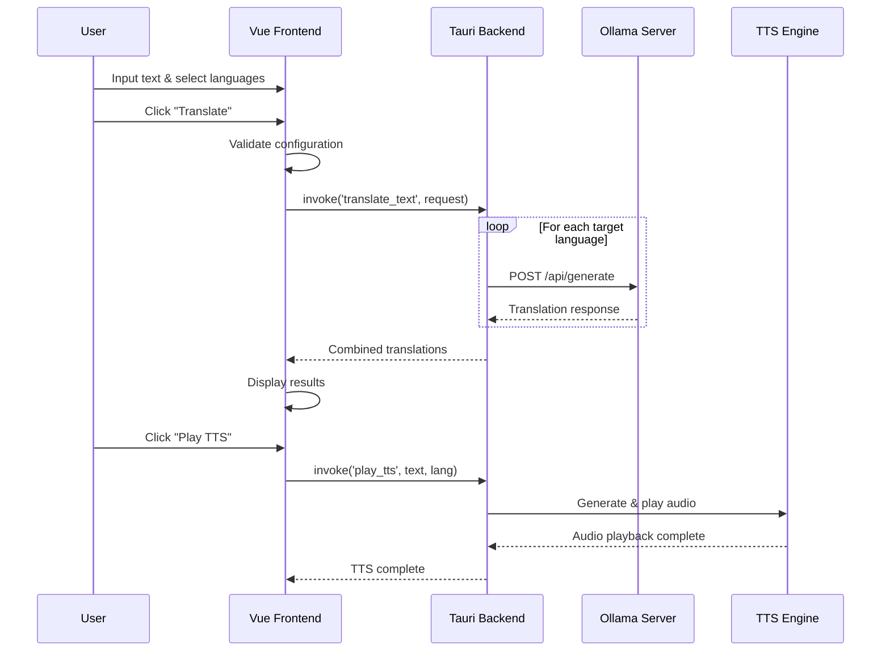

# Alouette - AI Translation & Text-to-Speech Tool

A cross-platform translation and text-to-speech application built with **Tauri v2 + Vue 3 + Rust**, supporting remote Ollama AI servers for high-quality multilingual translation and intelligent speech synthesis.


## 🚀 Environment Setup & Installation

### System Requirements

- **Node.js**: 18+
- **Rust**: 1.70+
- **Ollama Server**: Local or remote Ollama service

### Linux (Ubuntu/Debian)

```bash
# Install system dependencies
sudo apt update && sudo apt install -y \
  libwebkit2gtk-4.1-dev libjavascriptcoregtk-4.1-dev libgtk-3-dev \
  libsoup-3.0-dev libssl-dev libayatana-appindicator3-dev librsvg2-dev \
  build-essential clang llvm-dev libclang-dev python3-pip \
  espeak-ng flite

# Install Edge TTS (premium neural voices)
pip3 install --use-pep517 edge-tts

# Install project dependencies and run
npm install
npm run dev
```

### macOS

```bash
# Install Xcode Command Line Tools
xcode-select --install

# Install TTS engines (at least one is required)
brew install espeak-ng espeak

# (Optional) Install Edge TTS for premium neural voices
pip3 install --use-pep517 edge-tts

npm install -g @tauri-apps/cli
npm install --save-dev vite
npm run build
cd src-tauri && cargo build

# Install and run
npm install
npm run dev
```

### Windows

```bash
# Install Visual Studio Build Tools first
# Download: https://visualstudio.microsoft.com/visual-cpp-build-tools/

# Install Edge TTS
pip install --use-pep517 edge-tts

# Install and run
npm install
npm run dev
```

## ⚙️ Configuration

### Ollama Server Setup

1. Start the app and click **"⚙️ Settings"**
2. Enter Ollama server URL:
   - Local: `http://localhost:11434`
   - Remote: `http://your-ip:11434` or `https://your-domain.com:11434`
3. Test connection, select model, and save

#### Configuring Ollama for External Access

By default, Ollama only accepts connections from localhost. To allow external connections via systemd:

```bash
# Create systemd override directory
sudo mkdir -p /etc/systemd/system/ollama.service.d

# Create override configuration
sudo tee /etc/systemd/system/ollama.service.d/override.conf > /dev/null <<EOF
[Service]
Environment="OLLAMA_HOST=0.0.0.0:11434"
EOF

# Reload and restart service
sudo systemctl daemon-reload
sudo systemctl restart ollama
```

## ️ System Architecture

### TTS Engine Strategy

**Hybrid TTS System** with intelligent fallback:

1. **Edge TTS** (Primary) - Premium neural voices, requires internet
2. **espeak-ng** (Fallback) - Local synthesis, 80+ languages
3. **flite** (Backup) - Lightweight local engine

### Tech Stack

- **Frontend**: Vue 3.5 + Vite 6
- **Backend**: Tauri 2.2 + Rust
- **AI Service**: Ollama with Qwen2/Llama3.2 models
- **TTS**: Edge TTS + Rodio audio processing
- **Features**: SHA256 audio caching, auto language detection

### Translation Flow



### Supported Languages

English, Chinese, Japanese, Korean, French, German, Spanish, Italian, Russian, Arabic, Hindi, Greek

## 📦 Build Commands

```bash
npm run dev              # Development mode
npm run build            # Production build
npm run tauri android build    # Android APK (uses global Gradle config)
npm run tauri ios build        # iOS app (macOS only)
```

### Global Configuration

This project uses optimized global configurations for better performance:

- **Gradle**: Global config in `~/.gradle/` with China mirrors and performance optimizations
- **No Local Scripts**: All build scripts have been removed in favor of standard Tauri commands

## Demo

<iframe src="//player.bilibili.com/player.html?bvid=BV1qRM6zjErY&page=1&autoplay=0" 
        width="800" 
        height="450" 
        scrolling="no" 
        border="0" 
        frameborder="no" 
        framespacing="0" 
        allowfullscreen="true">
</iframe>


## Android Build & Deployment Guide

### Prerequisites

Ensure your project directory contains a complete Android SDK setup. The project uses global Gradle configuration for optimal performance.

```bash
# Set Android environment variables
export ANDROID_HOME=/home/hanl5/coding/alouette/android-sdk
export ANDROID_SDK_ROOT=$ANDROID_HOME
export JAVA_HOME=/usr/lib/jvm/java-17-openjdk-amd64
export PATH=$PATH:$ANDROID_HOME/platform-tools:$ANDROID_HOME/cmdline-tools/latest/bin
```

### Build with Tauri

The project now uses standard Tauri commands with global Gradle optimization:

```bash
# Build debug version (recommended for development)
npm run tauri android build -- --debug

# Build release version (requires signing setup)
npm run tauri android build
```

**Benefits of Global Configuration:**
- ✅ Faster builds with China mirrors
- ✅ Optimized memory usage and parallel builds
- ✅ Consistent configuration across projects
- ✅ No local Gradle files to maintain

---

## 📋 Project Structure

This project maintains a clean structure with minimal configuration files:
- All build scripts have been replaced with standard Tauri commands
- Global Gradle configuration provides optimal build performance
- No redundant local configuration files

### Launch Android Emulator & Deploy

```bash
# Start emulator in background
android-sdk/emulator/emulator -avd test_avd -no-snapshot-save &

# Wait for emulator to fully boot, then check device connection
adb devices
```

### Deploy & Verify

```bash
# 1. Confirm emulator is connected
adb devices

# 2. Install APK to emulator
adb install src-tauri/gen/android/app/build/outputs/apk/universal/debug/app-universal-debug.apk

# 3. Launch the application
adb shell am start -n com.alouette.app/com.alouette.app.MainActivity

# 4. Verify app process is running
adb shell ps | grep alouette

# 5. Check app logs for troubleshooting (optional)
adb logcat | grep -i "alouette\|rust\|tauri"
```

---

## 📋 Configuration Files

- All build scripts have been replaced with standard Tauri commands for better maintainability