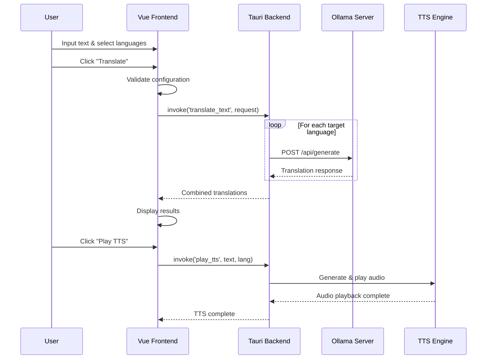

# Alouette - AI Translation & Text-to-Speech Tool

A cross-platform translation and text-to-speech application built with **Tauri v2 + Vue 3 + Rust**, supporting remote Ollama AI servers for high-quality multilingual translation and intelligent speech synthesis.


## 🚀 Environment Setup & Installation

### System Requirements

- **Node.js**: 18+
- **Rust**: 1.70+
- **Ollama Server**: Local or remote Ollama service

### Linux (Ubuntu/Debian)

```bash
# Install system dependencies
sudo apt update && sudo apt install -y \
  libwebkit2gtk-4.1-dev libjavascriptcoregtk-4.1-dev libgtk-3-dev \
  libsoup-3.0-dev libssl-dev libayatana-appindicator3-dev librsvg2-dev \
  build-essential clang llvm-dev libclang-dev python3-pip \
  espeak-ng flite

# Install Edge TTS (premium neural voices)
pip3 install --use-pep517 edge-tts

# Install project dependencies and run
npm install
npm run dev
```

### macOS

```bash
# Install Xcode Command Line Tools
xcode-select --install

# Install TTS engines (at least one is required)
brew install espeak-ng espeak

# (Optional) Install Edge TTS for premium neural voices
pip3 install --use-pep517 edge-tts

npm install -g @tauri-apps/cli
npm install --save-dev vite
npm run build
cd src-tauri && cargo build

# Install and run
npm install
npm run dev
```

### Windows

```bash
# Install Visual Studio Build Tools first
# Download: https://visualstudio.microsoft.com/visual-cpp-build-tools/

# Install Edge TTS
pip install --use-pep517 edge-tts

# Install and run
npm install
npm run dev
```

## ⚙️ Configuration

### Ollama Server Setup

1. Start the app and click **"⚙️ Settings"**
2. Enter Ollama server URL:
   - Local: `http://localhost:11434`
   - Remote: `http://your-ip:11434` or `https://your-domain.com:11434`
3. Test connection, select model, and save

#### Configuring Ollama for External Access

By default, Ollama only accepts connections from localhost. To allow external connections via systemd:

```bash
# Create systemd override directory
sudo mkdir -p /etc/systemd/system/ollama.service.d

# Create override configuration
sudo tee /etc/systemd/system/ollama.service.d/override.conf > /dev/null <<EOF
[Service]
Environment="OLLAMA_HOST=0.0.0.0:11434"
EOF

# Reload and restart service
sudo systemctl daemon-reload
sudo systemctl restart ollama
```

## ️ System Architecture

### TTS Engine Strategy

**Hybrid TTS System** with intelligent fallback:

1. **Edge TTS** (Primary) - Premium neural voices, requires internet
2. **espeak-ng** (Fallback) - Local synthesis, 80+ languages
3. **flite** (Backup) - Lightweight local engine

### Tech Stack

- **Frontend**: Vue 3.5 + Vite 6
- **Backend**: Tauri 2.2 + Rust
- **AI Service**: Ollama with Qwen2/Llama3.2 models
- **TTS**: Edge TTS + Rodio audio processing
- **Features**: SHA256 audio caching, auto language detection

### Translation Flow



### Supported Languages

English, Chinese, Japanese, Korean, French, German, Spanish, Italian, Russian, Arabic, Hindi, Greek

## 📦 Build Commands

```bash
# Desktop Development
npm run dev                    # Development mode
npm run build                  # Production build

# Android Development (ARM64 Optimized - macOS)
bash scripts/macos/quick-start.sh    # Complete ARM64 setup and build
bash scripts/macos/android-build.sh  # ARM64-specific build and deploy

# Utility Scripts
bash scripts/macos/view-logs.sh      # View Android app logs
bash scripts/macos/clean-android.sh  # Clean ARM64 build artifacts

# Manual Commands (if needed)
npm run tauri android init        # Initialize Android project
npm run tauri android build --debug   # Build debug APK
npm run tauri ios build          # iOS app (macOS only)
```

### Android Development Workflow (ARM64 Focus)

1. **First-time Setup**:
   ```bash
   # Setup Android environment (see alouette-guide-macos.md)
   cd ~/zoo && source android-env.sh
   ```

2. **Regular Development**:
   ```bash
   # Build and deploy ARM64 debug version (optimized)
   bash scripts/macos/android-build.sh
   
   # Or use quick-start for complete pipeline
   bash scripts/macos/quick-start.sh
   
   # View app logs
   bash scripts/macos/view-logs.sh
   ```

## Demo

<iframe src="//player.bilibili.com/player.html?bvid=BV1qRM6zjErY&page=1&autoplay=0" 
        width="800" 
        height="450" 
        scrolling="no" 
        border="0" 
        frameborder="no" 
        framespacing="0" 
        allowfullscreen="true">
</iframe>


## Android Build & Deployment Guide

### Prerequisites

For macOS users, follow the complete setup guide in `alouette-guide-macos.md`:
- Android SDK and NDK installation in `~/zoo`
- Environment variables configuration
- ARM64 emulator setup

### Quick Start

```bash
# 1. Setup Android environment (first time only)
cd ~/zoo && source android-env.sh

# 2. Build and deploy debug APK (no signing required)
bash scripts/android-build.sh

# 3. View logs
bash scripts/view-logs.sh
```

### Available Scripts (macOS ARM64 Focus)

| Script | Purpose | Target |
|--------|---------|---------|
| `scripts/macos/quick-start.sh` | Complete ARM64 setup and build pipeline | ARM64 |
| `scripts/macos/android-build.sh` | Builds and deploys ARM64 debug APK | ARM64 |
| `scripts/macos/status-check.sh` | Check project and environment status | All |
| `scripts/macos/view-logs.sh` | Views filtered Android app logs | All |
| `scripts/macos/clean-android.sh` | Cleans ARM64 build artifacts | ARM64 |

### Manual Build Process

```bash
# Load Android environment
cd ~/zoo && source android-env.sh && cd /Users/han/coding/alouette-app

# Build debug APK (no signing required)
npm run tauri android build --debug

# Deploy
adb install -r src-tauri/gen/android/app/build/outputs/apk/universal/debug/app-universal-debug.apk
adb shell am start -n com.alouette.app/com.alouette.app.MainActivity
```

**Benefits of Debug Workflow:**
- ✅ No signing configuration needed
- ✅ Fast development iteration
- ✅ Automatic debug certificates
- ✅ Simple build process
- ✅ Direct device deployment